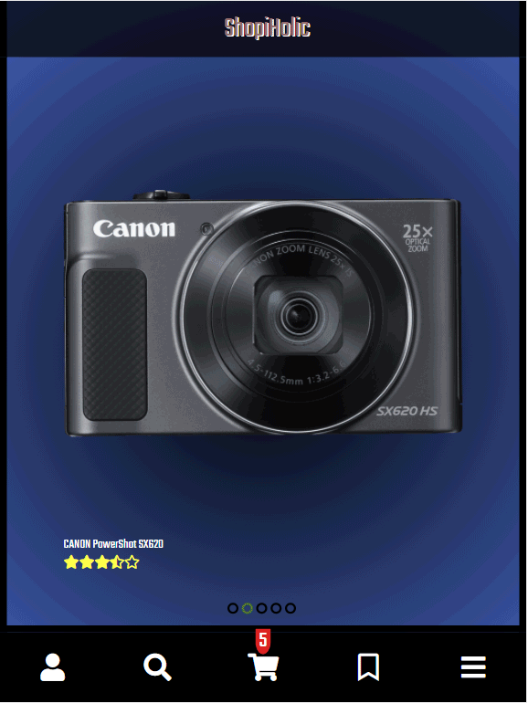

# Photo eCommerce-Shop

Interested in building a responsive Webshop with backend & frontend. Manage stock, handle orders, update shopping cart & implement checkout process. PayPal integration. Still under construction!

## Tech Stack:

-   TypeScript
-   React
-   Redux
-   MySQL
-   Node.js

## Preview:

### Features:

-   Shopping Cart
-   Categorized by products
-   Checkout process (address, billing, PayPal)
-   PayPal-API (missing)
-   Product Search
-   Infinite Scrolling
-   Wishlist
-   Admin Management (missing)
-   User Login (missing)
-   Product rating
-   Product Carousel
